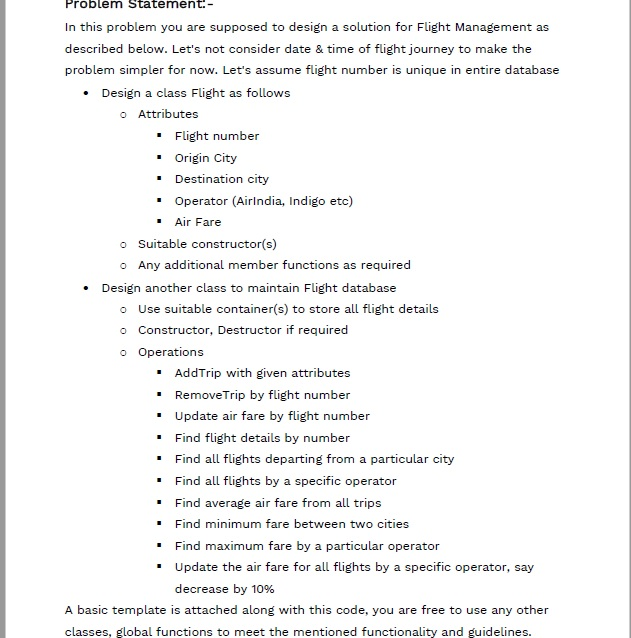

### Problem statement



### How to run the program on Windows

* Navigate to the folder on a terminal.
* To compile source code and create executable, enter the command in terminal: 
```g++ main.cpp flight_databse.cpp```
* To name the executable, enter the command in terminal: 
```g++ -o a main.cpp flight_databse.cpp```
* To run, enter the command in terminal: 
```.\a```