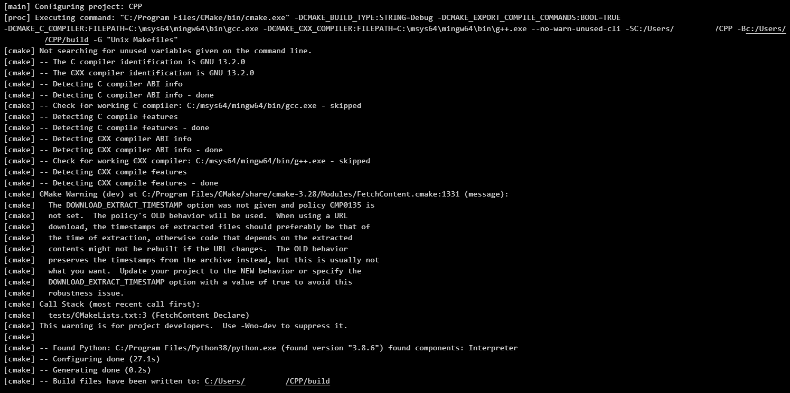
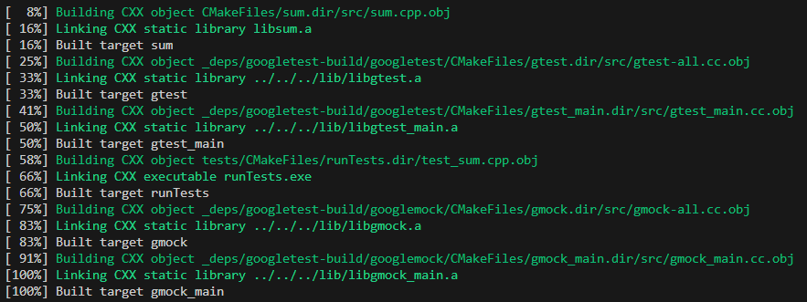
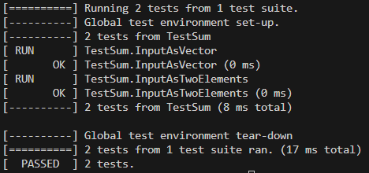

## Sample CPP
Create and build a multifile CPP project with unit test.

### Prerequisite
1. [CMake](https://cmake.org/)
2. [Make](https://www.gnu.org/software/make/)
3. Appropriate compiler is installed.

### Files
    CPP                                # Multifile CPP repository
    ├── src                            # Source code folder                   
    │   ├── main.cpp                   # Main file
    │   ├── sum.cpp                    # Sum implementation file
    ├── include                        # Source code folder                   
    │   ├── sum.h                      # Sum header file
    ├── tests                          # Unit test                   
    │   ├── test_sum.cpp               # Source file for unit tests
    │   ├── CMakeLists.txt             # Build instructions at test level   
    ├── CMakeLists.txt                 # Build instructions at project level                           
    └── README.md

### How to run
In terminal (powershell for e.g.),
1. Create and enter ```build``` directory (if code is not already built).<br>
```mkdir build && cd build```
2. Run CMake.<br>
```cmake ..```<br>
This command uses the cmake at the top-level [CMakeLists.txt](/CMakeLists.txt) to configure the project and create a Makefile in the build directory.
```make```<br>
Make finds the Makefile and uses the instructions in the Makefile to build the project.<br>



### How to run unit tests
1. Run the generated execultable in ```build/tests``` folder.<br>
```.\runTests.exe```<br>


### Useful links 
Compilers 
1. [Mingw](https://packages.msys2.org/package/mingw-w64-x86_64-gcc) 
2. [Msys2](https://www.msys2.org/) 

Discussions
1. [Templates](https://stackoverflow.com/questions/13025266/redefinition-of-templateclass-t-in-c)

Google Tests
1. [Incorporating gTest in existing project](https://github.com/google/googletest/blob/main/googletest/README.md#incorporating-into-an-existing-cmake-project)
